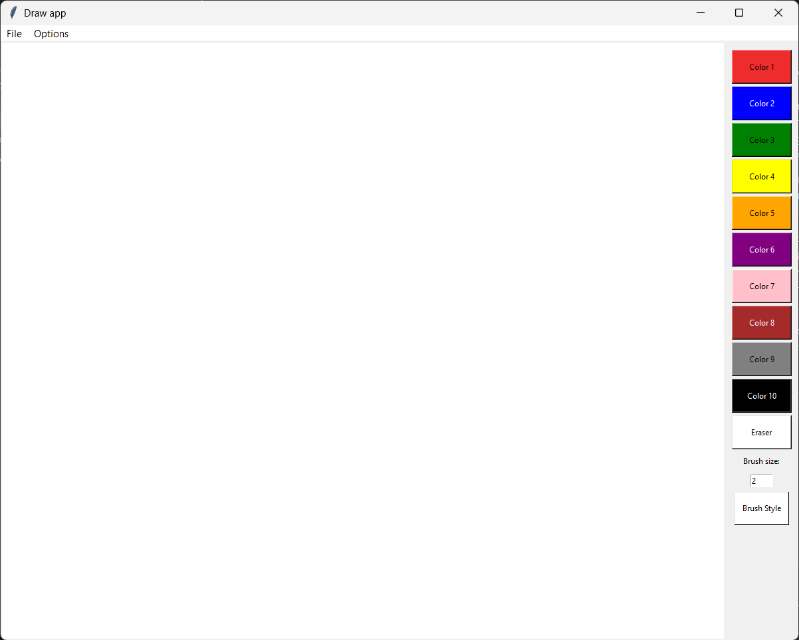

# How to run Draw App

## Import files from git:

```bash
cd Path/To/Your/Folder
git init
git clone https://github.com/githubmako/drawAppPy
```
## Install required python libraries

```bash 
pip install tkinter
pip install pillow
```

## Compile:

```bash
cd Path/To/Your/Folder
python main.py
```

